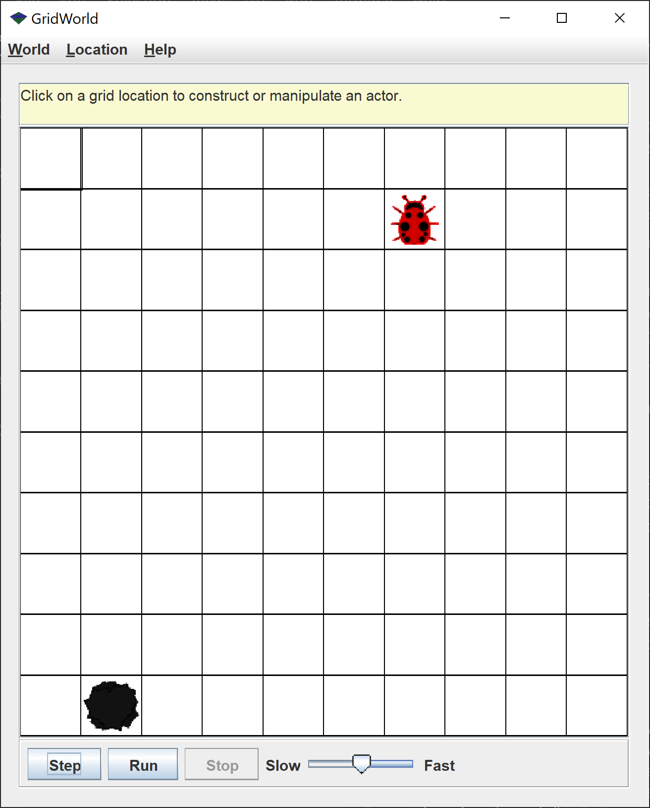
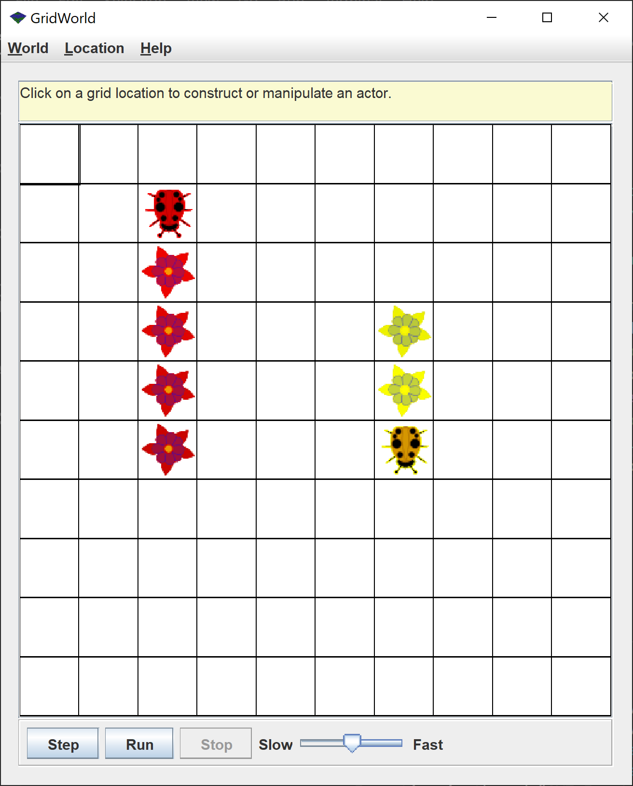

# 06_git2

Lesson Slides: [here](https://docs.google.com/presentation/d/1I6M1l_POiYG95YKMh-ZkZALHu0sUyhsVrgU8gIOpjFo/edit?usp=sharing)<br />
Recording: tba <br />

## Introduction 
<p> Note: Despite being called git2 this assignment has little to do with git.</p>

<p>For this assignment you will be doing some graphics through an OOP interface.</br>



<p>
Create a folder with your group # (no spaces please!).</br>
For each file append <code>package</code> followed by your group #.</br>
See the example.</br>
</p>

## Classes Overview

<p> Here is a quick overview of the class that interact in the GridWorld.</p> 

### Actor
<p>
The <code>Actor</code> is base class for other moving objects.
</p>

```java
public void act()
```
<p>&emsp; what will the actor do in each loop (ie move, turn).</p> 

```java 
public Color getColor()
public int getDirection()
public Grid<Actor> getGrid()
public Location getLocation()
```
<p>&emsp; the above getter methods will get certain properties of an <code>Actor</code>. 

```java 
public void setColor(Color color)
public void setDirection(int direction)
public void setGrid(Grid<Actor> gr)
public void setLocation(Location loc)
```
<p>&emsp; the above methods set thsoe values</p>

### Bug 
<p> 
All classes that inherit from the <code>Bug</code> class can override three methods that change the Bug's behavoir.</br>
In addition the <code>Bug</code> class inherits from <code>Actor</code>.
Below are the methods and their default behavior.
</p>

```java
public boolean canMove()
```
<p>&emsp; tests whether the bug can move forward into a location that is empty or has a flower</p>  

```java 
public void move()
```
<p>&emsp; moves the bug forward puttting a flower in the current location</p>

```java 
public void turn()
```
<p>&emsp; turns the bug 45 degrees to the right without changing location</p>

### Location
<p>
The <code>location</code> class stores a location on the grid. 
</p>

```java 
public Location(int r, int c)
```
<p>
&emsp; this is the constructor </br>
&emsp; <b>r</b>: row (aka y coordinate). first row is 0 and is at the top.</br>
&emsp; <b>c</b>: column (aka x coordinate). first col is 0 and is at the left.</br>
</p>

```java 
public int getRow()
public int getCol()
```
<p>&emsp; gets the row and col respectively</p>

### ActorWorld
<p>
The <code>ActorWorld</code> is the place where all the actors do stuff
</p>

```java 
public ActorWorld()
```
<p>&emsp; creates the actor world</p>

```java 
public void add(Actor actor)
public void add(Location loc, Actor actor)
```
<p>
&emsp; puts an actor onto the world</br>
&emsp; <b>actor</b>: the instance of an actor to be added</br>
&emsp;&emsp; why might an instance of the Bug class be valid for this?</br>
<details>
<summary>answer</summary>
&emsp;&emsp; <code>Bug</code> inherits <code>Actor</code> and therefore can be substituded for it. this is called <b>Polymorphism</b>. 
</details>
&emsp; <b>loc</b>: the location if specified otherwise random</br>
&emsp; Note: this is an exmaple of method overloading
</p>

```java
public void show()
```
<p>
&emsp; displays the world. don't forget this!
</p>

#### Example: 
```java 
import info.gridworld.actor.ActorWorld;
import info.gridworld.actor.Bug;

public static void main(String[] args)
{
    ActorWorld world = new ActorWorld(); 
    world.add(new Bug()); 
    world.show(); 
}
```


## Assignment
1. Make a class called <code>BoxBug</code> that extends <code>Bug</code> but moves in a square. The side length should be changable and the default should be 4.</br>
<p>
<b>Hint</b>:</br> 
&emsp; What new variable might we need in <code>BoxBug</code> that is not already in <code>Bug</code>?</br>

&emsp; How might we store the side length? 
<details>
<summary>answer</summary>
&emsp; <code>int sideLength</code>
</details>
</br>

&emsp; How might we store the steps taken? 
<details>
<summary>answer</summary>
&emsp; <code>int steps</code>
</details>
</br>

&emsp; Any extra parameters in the constructor?
<details>
<summary>answer</summary>
&emsp; <code>public BoxBug(int sideLength)</code> 
</details>

</p>

2. Make a class called <code>CircleBug</code> that extends <code>Bug</code> and makes a circle.  
<p>
<b>Hint</b>: instead of calling <code>turn</code> twice call it once. 
</p>

3. Make a class called <code>SpiralBug</code> that extends <code>Bug</code> and makes a spiral. 
<p>
<b>Hint</b>: think about how the side length might change. 
</p>

## Extra
Want more? You can see the full assignemt [here](https://drive.google.com/file/d/12Kd_t2hainOyO7B3dnClbNQ2vnV-iCvF/view?usp=sharing).</br>
Beware that there might be a lot of stuff that we haven't taught you yet. You can serach them as you go along.</br>
